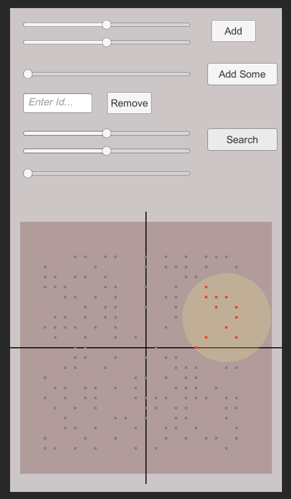

# AOI
使用Unity3D和C#实现的基于十字链表的AOI逻辑。

AOI based on orthogonal linked list which is implemented by C# in Unity3D.

###  1. 概述

AOI（Area Of Interest）是常用于游戏的一种算法，使用的是空间划分的思想，来解决游戏单元之间位置关系。

所以，相比于使用“两点之间距离公式”的方式来计算，AOI更高效。

### 2. 实现概述

AOI的空间划分方式，常见的是：十字链表和九宫格。

本仓库使用的是：十字链表。


相比于“十字链表”，也许命名为“两支双链表”或“双 双链表”更好理解。

所以，两支双链表，即一支Y坐标双链表（有序）和一支X坐标双链表（有序）

所以：

- 往AOI中增加单元：即 两支双链表的插入操作 O(2*N)
- 往AOI中删除单元：即 两支双链表的删除操作 O(2*N)
- 在AOI中按照范围搜索：即 双链表的带剪枝的遍历操作 O(N) 

### 3. 建议用法及API

概念说明：

- LogicEntity：AOI中的节点
- AOIManager：AOI中所有节点的manager

####  AOIManager类

```c#
AOIManager(string name)
```

- 构造函数，创建Manager对象，参数作为manager id的name。

```c#
Destroy()
```

- 销毁Manager对象。

```c#
LogicEntity CreateLogicEntity(int id, int layer = ConstDefine.ALL_ONE, float radius = 0)
```

- 创建LogicEntity
  - id：LogicEntity的id
  - layer：LogicEntity的layer，用于与运算的类型层级筛选，默认为all *（todo）*
  - radius：LogicEntity的半径 *（todo）*

```c#
void DestroyLogicEntity(LogicEntity entity)
```

- 销毁指定LogicEntity

```c#
IList<LogicEntity> GetLogicEntitiesInRangeByCenter(Vector2 centerPos, float range,
    int layer = ConstDefine.ALL_ONE, int maxCount = int.MaxValue, bool isSort = false)
```

- 根据**中心点**进行范围查找，返回范围内符合条件的LogicEntity集合
  - centerPos：中心点坐标
  - range：范围半径
  - layer：指定的筛选类型层级 *（todo）*
  - maxCount：返回的上线数目 *（todo）*
  - isSort：返回结果时是否需要按照距离排序 *（todo）*



```c#
string DebugShow()
```

- 输出调试信息，同时也将调试信息作为string返回值返回

#### LogicEntity类

```c#
int GetId()
```

- 获取LogicEntity的id

```c#
Vector2 GetPos()
```

- 获取LogicEntity的坐标

```c#
SetPos(Vector2 pos)
```

```c#
SetPos(float x, float y)
```

- 获取LogicEntity的坐标

```c#
GetLogicEntityInRange(float range, int type = ConstDefine.ALL_ONE,
            int maxCount = int.MaxValue, bool isSort = false)
```

- 根据**LogicEntity自身**进行范围查找，返回范围内符合条件的LogicEntity集合
  - range：范围半径
  - layer：指定的筛选类型层级 *（todo）*
  - maxCount：返回的上线数目 *（todo）*
  - isSort：返回结果时是否需要按照距离排序 *（todo）*


### 4.  TODO和其他

1. 十字链表 VS 九宫格
   - 十字链表方式的开销 *更* 取决于单位数目
   - 九宫格方式的开销 *更* 取决于地图大小
   - 所以：
     - 十字链表更适合“单位数目少，地图大”；九宫格更适合“单位数目多，地图小”
     - 如果采用十字链表，“单位扎堆”则会导致性能下降
2. 在“范围查找”操作中（本质即是一个排序链表的遍历问题），可以考虑**快慢指针、剪枝、X-Y轴权重**等方式优化
3. 如果有通过id获取LogicEntity的需求，那么可以考虑在AOIManager里保存一个**Dictionary<int, LogicEntity>**
4. 如果AOI用于帧同步游戏中，则需要考虑**定点数**版本
5. 目前是“主动调用模式”，进一步需要考虑“**回调模式**”
6. 如上所述：半径、layer、排序等，目前处于todo状态